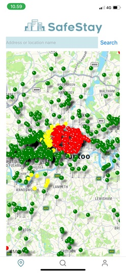
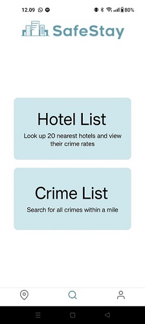
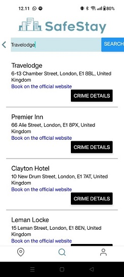
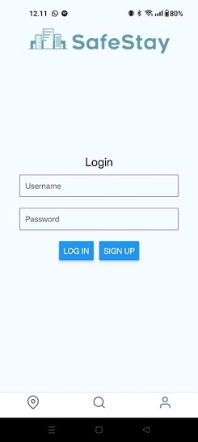

## SafeStay

Mobile application that helps user to choose hotel in London based on the safety of the surrounding area in 1 mile radius.

### About the project

SafeStay allows you to view and ensure the safety of your hotel's area. In the application, you can browse hotels in London, UK and view a map, which displays the safety of hotels areas with color codes (green - yellow - red). The app also allows you to view crimes that have occurred in specific areas.  
SafeStay utilizes React Native Maps, Geoapify and crime data from the UK police.  
Stay safe!

### Built with

- TypeScript
- React Native, EXPO
- React Native Maps
- Geoapify
- UK Police Crime data

### Getting started

1. Install Node.js (prerequisite)
   > https://nodejs.org/en/learn/getting-started/how-to-install-nodejs

Note: Node.js must be installed on your computer.

2. Install Expo (prerequisite)
   > https://docs.expo.dev/get-started/installation/

Note: Either Expo Go app or an emulator must be installed to run the app

- To install emulators:
- Android:

  > https://docs.expo.dev/workflow/android-studio-emulator/

- IOS:
  > https://docs.expo.dev/workflow/ios-simulator/

3. Clone repository to your local computer
   > git clone https://github.com/SafeStay/SafeStayMobile.git

Note: you will need API keys. Ask for the keys from the creators.

4. Navigate to the project's local repository

5. Install dependencies

   > npm install

6. Run the app
   > npx expo start

Note: if you face issues running the app with the command above try;

> npx expo start --tunnel

IOS: Scan the QR code with QR scanner  
Android: Scan the code with Expo Go app

- Run the app with Android emulator:

Start the Android emulator app on the computer

> npx expo start --android

### Screenshots

Overlook of London with color coded hotelmarkers  
  
Map's view zoomed closer in  
  
Map's view with red marked hotel pressed; hotel's name, address and total amount of crimes within a mile displayed  
Red marker indicates there are more than 8 crimes within 1 mile of the hotel  
  
Yellow marked hotel pressed  
Yellow marker indicates there are 3 to 7 crimes within 1 mile of the hotel  
  
Green marked hotel pressed  
Green marker indicates there are 2 or less crimes within 1 mile of the hotel  
  
Search tab selected from the tab navigation

Crime search "Tottenham" in the Crime List component

Hotel search "Travelodge" in the Hotel List component

Login screen tab selected from the tab navigation

### Creators

Need help or want to ask something? Contact us via GitHub!  
[Suvi](https://github.com/SuviAnnina), [Arttu](https://github.com/ArttuuS/), [Akseli](https://github.com/AkseliVa), [Lassi](https://github.com/Lassive), [Jenna](https://github.com/jenvii), [Hilda](https://github.com/NotInUseHi)

### Licence

See the [Licence](https://github.com/SafeStay/SafeStayMobile/blob/main/LICENSE.md) file for license rights and limitations (MIT).
